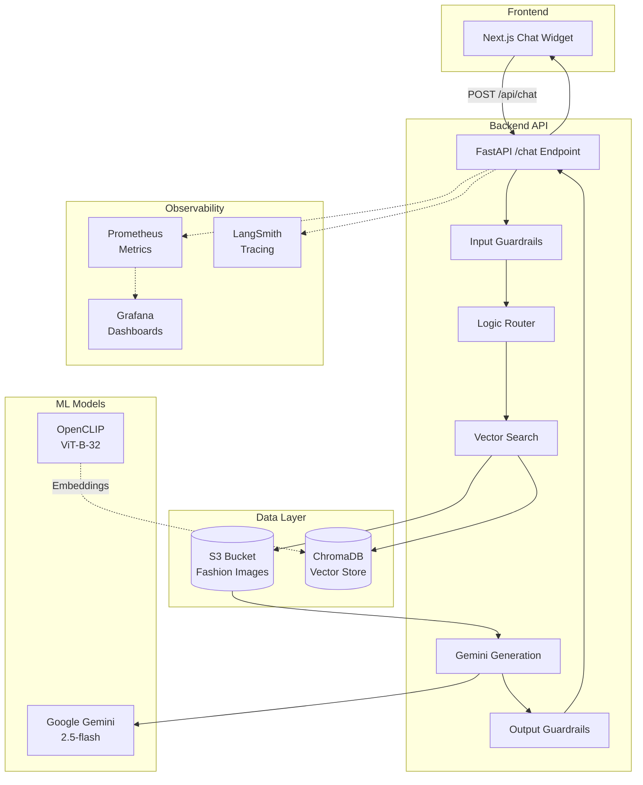
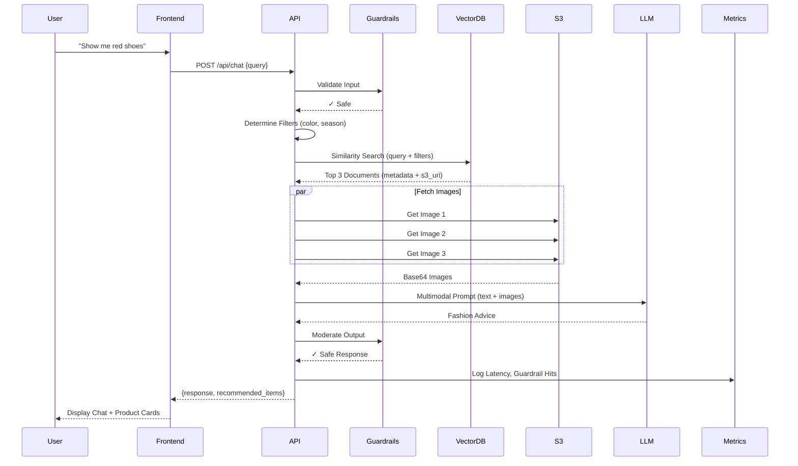

# StyleSync - AI-Powered Fashion Recommendation System

## 🎯 Project Overview

StyleSync is a production-grade **Retrieval-Augmented Generation (RAG)** system that provides personalized fashion recommendations using multimodal AI. The system combines **visual search** (CLIP embeddings), **vector retrieval** (ChromaDB), and **generative AI** (Google Gemini) to deliver contextual, fashion-forward advice.

### LLMOps Objectives

This project demonstrates a complete **LLMOps lifecycle**:

1. **Data Ingestion & Vectorization**: Automated pipeline to ingest fashion images/metadata from S3 and create embeddings
2. **Retrieval Logic**: Semantic search with metadata filtering (season, trends, color)
3. **Generation with Guardrails**: Multi-modal LLM generation with input/output validation
4. **Monitoring & Observability**: Prometheus metrics, Grafana dashboards, and LangSmith tracing
5. **CI/CD**: Automated testing, linting, Docker builds, and canary deployments
6. **Security**: Guardrails for prompt injection, PII detection, and content moderation

---

## 🏗️ System Architecture

### High-Level Architecture



### Data Flow Diagram



---

## 📊 Monitoring Dashboards

### Grafana Dashboards

Access real-time metrics at **http://localhost:3000** (default credentials: `GrafanaUser` / see `.env`)

**Key Metrics Tracked:**
- **Request Latency**: P50, P95, P99 response times
- **Guardrail Triggers**: Input/Output validation failures by rule
- **Error Rates**: 4xx/5xx by endpoint
- **Throughput**: Requests per second

### LangSmith Tracing

View detailed LLM call traces at [smith.langchain.com](https://smith.langchain.com)

Traced operations:
- `retrieve_documents`: Vector search performance
- `generate_fashion_advice`: LLM generation time
- `chat_endpoint_flow`: End-to-end request flow

---

## 🚀 Deployment Guide

### Prerequisites

- **Python 3.9+**
- **Node.js 18+** (for frontend)
- **Docker & Docker Compose** (for monitoring stack)
- **AWS Credentials** (for S3 access)
- **Google API Key** (for Gemini)

### 1. Clone Repository

```bash
git clone https://github.com/Hammadullah2/StyleSync.git
cd StyleSync
```

### 2. Environment Setup

```bash
# Copy example env file
cp .env.example .env

# Required variables:
# GOOGLE_API_KEY=your_gemini_api_key
# AWS_ACCESS_KEY_ID=your_aws_key
# AWS_SECRET_ACCESS_KEY=your_aws_secret
# S3_BUCKET_NAME=stylesync-mlops-data
# LANGCHAIN_API_KEY=your_langsmith_key
```

### 3. Install Dependencies

```bash
# Backend
python -m venv .venv
source .venv/bin/activate  # On Windows: .venv\Scripts\activate
pip install -r requirements.txt

# Frontend
cd src/frontend
npm install
cd ../..
```

### 4. Run Data Ingestion

```bash
# Ingest fashion dataset from S3
python src/ingest.py
```

This will:
- Download images and metadata from S3
- Generate CLIP embeddings
- Store vectors in ChromaDB (`./chroma_db`)

### 5. Start Backend API

```bash
uvicorn src.app:app --host 0.0.0.0 --port 8000 --reload
```

**Verify**: Visit [http://localhost:8000/health](http://localhost:8000/health)

### 6. Start Frontend

```bash
cd src/frontend
npm run dev
```

**Access**: [http://localhost:3001](http://localhost:3001)

### 7. Start Monitoring Stack (Optional)

```bash
docker compose up -d
```

This starts:
- **Prometheus** (metrics collection): `localhost:9090`
- **Grafana** (dashboards): `localhost:3000`

---

## 📖 API Usage Examples

### Chat Endpoint

**Request:**

```bash
curl -X POST http://localhost:8000/chat \
  -H "Content-Type: application/json" \
  -d '{
    "query": "I need trendy summer shoes"
  }'
```

**Response:**

```json
{
  "response": "Here are some trendy summer options: 1. **Vibrant Sneakers**: Bold pink/blue canvas for a pop of color. 2. **Classic White Low-Tops**: Versatile and timeless. 3. **Sporty Trainers**: Comfortable for active days.",
  "recommended_items": [
    {
      "productDisplayName": "Nike Women Pink Sneakers",
      "s3_uri": "https://stylesync-mlops-data.s3.amazonaws.com/.../12345.jpg",
      "metadata": {
        "season": "Summer",
        "baseColour": "Pink",
        "year": 2023
      }
    }
  ]
}
```

### Sample Queries

| Query | Filters Applied | Expected Results |
|-------|----------------|------------------|
| `"red shoes"` | Color extraction | Red footwear items |
| `"trendy winter jacket"` | year >= 2022, season=Winter | Recent winter outerwear |
| `"casual summer dress"` | season=Summer | Summer dresses |
| `"blue pants"` | Color extraction | Blue trousers |

### Health Check

```bash
curl http://localhost:8000/health
# Response: {"status": "ok"}
```

### Metrics Endpoint

```bash
curl http://localhost:8000/metrics
# Prometheus-format metrics
```

---

## 🧪 Testing

### Run Unit Tests

```bash
python -m pytest -q --cov=src
```

**Coverage:** 86% (13 guardrail tests + 6 metrics tests)

### Test Guardrails

```bash
python -m pytest tests/test_guardrails.py -v
```

### Test Metrics

```bash
python -m pytest tests/test_metrics.py -v
```

---

## 🔒 Security

See [SECURITY.md](SECURITY.md) for:
- Prompt injection defenses
- PII detection mechanisms
- Data privacy practices

---

## 📊 Evaluation

See [EVALUATION.md](EVALUATION.md) for:
- Prompt engineering experiments
- Retrieval quality metrics
- A/B test results

---

## 🛠️ Tech Stack

| Component | Technology |
|-----------|-----------|
| **Backend** | FastAPI, Python 3.9 |
| **Vector DB** | ChromaDB |
| **Embeddings** | OpenCLIP (ViT-B-32) |
| **LLM** | Google Gemini 2.5-flash |
| **Frontend** | Next.js 16, React, TailwindCSS |
| **Storage** | AWS S3 |
| **Monitoring** | Prometheus, Grafana, LangSmith |
| **CI/CD** | GitHub Actions |
| **Containerization** | Docker, Docker Compose |

---

## 📁 Project Structure

```
StyleSync/
├── src/
│   ├── app.py                 # FastAPI backend
│   ├── ingest.py              # Data ingestion pipeline
│   ├── guardrails/            # Input/output validation
│   ├── metrics.py             # Prometheus metrics
│   └── frontend/              # Next.js app
├── tests/
│   ├── test_guardrails.py     # Guardrail unit tests
│   └── test_metrics.py        # Metrics unit tests
├── chroma_db/                 # Vector database
├── docker-compose.yml         # Monitoring stack
├── .github/workflows/         # CI/CD pipelines
├── README.md
├── SECURITY.md
└── EVALUATION.md
```

---

## 🤝 Contributing

1. Fork the repository
2. Create a feature branch: `git checkout -b feature/amazing-feature`
3. Run tests: `python -m pytest`
4. Commit changes: `git commit -m 'Add amazing feature'`
5. Push to branch: `git push origin feature/amazing-feature`
6. Open a Pull Request

---

## 📄 License

MIT License - See [LICENSE](LICENSE) file for details

---

## 👤 Authors

- **Hammad Ullah** - [Hammadullah2](https://github.com/Hammadullah2)

---

## 🙏 Acknowledgments

- **OpenCLIP** for vision embeddings
- **LangChain** for RAG orchestration
- **Google Gemini** for multimodal generation
- **Grafana Labs** for monitoring toolkit
