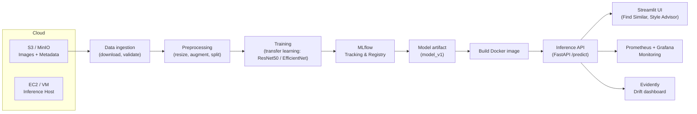

# StyleSync – A Multi-Modal Fashion Recommendation System

A production-ready MLOps system to classify fashion attributes and power a multi-modal style advisor.

---

## 🏛️ Architecture

This diagram shows the complete MLOps workflow for **Milestone 1**, from data ingestion to a monitored inference API.


---

## AWS Cloud Setup (Free-Tier Hybrid MLOps Workflow)

This guide documents the AWS configuration used for the **StyleSync – MLOps Project**.  
It explains how we created our AWS account, IAM user, installed and configured the AWS CLI,  
and prepared an S3 bucket for future data and model storage.

---

### Step 1 — Create an AWS Account
1. Visit [https://aws.amazon.com/](https://aws.amazon.com/) and sign up for a new account.  
2. Enable **Free Tier** usage during registration.  
3. Verify your phone number and add a debit/credit card (required for activation).  
4. After confirmation, log in to the **AWS Management Console**.

---

###  Step 2 — Create an IAM User for CLI / Kaggle Access
1. Open the **IAM Console** → [Users → Create user](https://console.aws.amazon.com/iam/home#/users).  
2. **User name:** `mlops-user`  
3. (Optional) Check **Provide user access to the AWS Management Console** if you also want password sign-in.  
4. Click **Next**.  
5. Under **Set permissions**, choose **Attach policies directly** and select:  
   -  `AmazonS3FullAccess`  
   - (Optional) `AmazonEC2FullAccess` for later EC2 use  
6. Click **Create user**.  
7. After creation:  
   - Open the new user → **Security credentials** tab.  
   - Scroll to **Access keys** → click **Create access key**.  
   - Choose **Use case: Command Line Interface (CLI)** → **Next** → **Create access key**.  
   - **Download the `.csv` file** containing:
     ```
     AWS_ACCESS_KEY_ID
     AWS_SECRET_ACCESS_KEY
     ```

**Why:** this IAM user provides secure **programmatic access** for the AWS CLI, Kaggle notebooks, and GitHub Actions.

---

### Step 3 — Install & Configure AWS CLI (on local machine)

#### Install the AWS CLI
- Download the 64-bit Windows installer:  
  [https://awscli.amazonaws.com/AWSCLIV2.msi](https://awscli.amazonaws.com/AWSCLIV2.msi)  
- Run the installer (keep defaults).  
- Open a **new PowerShell** window and verify:
  ```bash
  aws --version
- You would see the following:
  ```bash
  aws-cli/2.x.x Python/3.x.x Windows/10 exe/AMD64


#### Configure the AWS CLI
- Run the following command:
  ```bash
  aws configure  
- Enter the values from your downloaded .csv file (created when setting up the IAM user):
  ```bash
  AWS Access Key ID [None]: <your key>
  AWS Secret Access Key [None]: <your secret>
  Default region name [None]: us-east-1
  Default output format [None]: json
- Verify the configure:
  ```bash
  aws sts get-caller-identity
- Expected Output:
  ```bash
  {
  "UserId": "AIDAEXAMPLE12345",
  "Account": "123456789012",
  "Arn": "arn:aws:iam::123456789012:user/mlops-user"
  }

---

### Step 4 — Create an S3 Bucket for Data and Models

1. Open the [S3 Console](https://s3.console.aws.amazon.com/s3/home).  
2. Click **Create bucket**.  
3. Configure:
   - **Bucket name:** `stylesync-mlops-data` *(must be globally unique)*
   - **Region:** `us-east-1`
   - **Block all public access:** Enabled
   - Leave all other settings as default.
4. Click **Create bucket**.

#### Folder Structure (prefix layout)

After creation, open your bucket and create the following folder structure:

```bash
stylesync-mlops-data/
└── style-sync/
├── raw/ # Original Kaggle dataset
├── processed/ # Cleaned & augmented data
├── models/ # Trained model artifacts
├── mlflow/ # Experiment tracking
└── monitoring/ # Drift reports & monitoring data
```

*S3 will automatically create these folders when files are uploaded. Creating them now helps organize project data clearly.*


---

### Step 5 — Upload Dataset to S3 (from Local Machine)

Since the Kaggle GPU is unavailable, and the dataset is already downloaded locally,  
upload it directly to the S3 bucket using the AWS CLI.

#### Command
Run the following in PowerShell (replace the path with your local dataset directory):

```bash
aws s3 cp "C:\path\to\fashion-dataset" s3://stylesync-mlops-data/style-sync/raw/fashion/ --recursive
```

This will recursively upload all files and folders inside `fashion-dataset/` to the S3 bucket path:
```bash
s3://stylesync-mlops-data/style-sync/raw/fashion/
├── images/
├── styles/
├── images.csv
└── styles.csv
```
---

### Step 6 — Launch an EC2 Instance for MLflow Tracking Server

We’ll use an EC2 Ubuntu instance to host the MLflow Tracking UI and connect it with the S3 bucket for model artifacts.

#### Launch an EC2 Instance

- Go to the EC2 Console
  - Click Launch instance → Configure:
  - Name: mlflow-server
  - AMI: Ubuntu Server 24.04 LTS (HVM), SSD Volume Type
  - Architecture: 64-bit (x86)
  - Instance type: t3.micro (Free tier eligible)
  - Key pair: Create new → name it `mlops-key.pem` → download and keep safe.
  - Network settings:
  - Auto-assign public IP → Enable
  - Create a new Security Group → allow the following:
  ```bash
  Type        Protocol  Port Range  Source
  SSH          TCP        22         0.0.0.0/0
  HTTP         TCP        80         0.0.0.0/0
  Custom TCP   TCP        5000       0.0.0.0/0   # For MLflow UI
  ```
- Storage: 20 GiB (gp3).

- Click **Launch instance**, then wait for the status to show **Running**.

- Copy the **Public IPv4 address** — you’ll use this to connect and open the MLflow dashboard.

#### Connect to EC2 via SSH

From your local terminal (in the same directory where `mlops-key.pem` was downloaded):
```bash
ssh -i mlops-key.pem ubuntu@<your-ec2-public-ip>
```

You’ll now be inside the EC2 instance:
```bash
ubuntu@ip-xxx-xx-xx-xxx:~$
```

#### Setup MLflow Tracking Server on EC2
1. Create and activate a virtual environment (important)
```bash
sudo apt update -y
sudo apt install python3-venv -y
python3 -m venv mlflow-venv
source mlflow-venv/bin/activate
```

2. Install dependencies inside the venv
```bash
pip install mlflow boto3
```

**Note**:
If you try `pip install` without a virtual environment, you’ll get the
*externally-managed-environment* error (Ubuntu 24.04 restriction).
Always install inside a venv to avoid this.

3. Start the MLflow Server
```bash
MLFLOW_TRACKING_INSECURE_HTTP=true mlflow server \
  --backend-store-uri sqlite:///mlflow.db \
  --default-artifact-root s3://stylesync-mlops-data/style-sync/mlflow/ \
  --host 0.0.0.0 \
  --port 5000 \
  --allowed-hosts "*" --cors-allowed-origins "*"
```

The `--allowed-hosts` and `--cors-allowed-origins` flags fix
the *Invalid Host Header / 403 Forbidden* issue when accessing from a browser.

4. Run MLflow persistently in the background

To keep MLflow running after logout:
```bash
nohup bash -c 'MLFLOW_TRACKING_INSECURE_HTTP=true mlflow server \
  --backend-store-uri sqlite:///mlflow.db \
  --default-artifact-root s3://stylesync-mlops-data/style-sync/mlflow/ \
  --host 0.0.0.0 --port 5000 \
  --allowed-hosts "*" --cors-allowed-origins "*"' > mlflow.log 2>&1 &
```

To check the logs:
```bash
tail -f mlflow.log
```

#### Verify MLflow Dashboard

Open this in your local browser: `http://<your-ec2-public-ip>:5000` 

You should now see the MLflow UI running live on your EC2 instance.