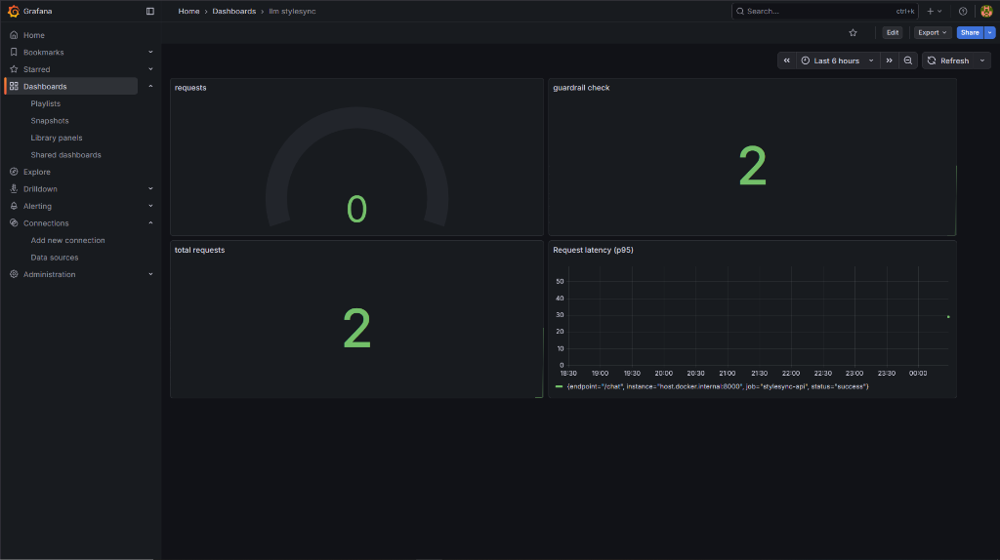

# LLM Evaluation & Monitoring Report

## Overview
This document describes the monitoring infrastructure for StyleSync's LLM/RAG system.

## Dashboard Screenshot


## Architecture

```
┌─────────────────┐     ┌─────────────────┐     ┌─────────────────┐
│  StyleSync API  │────▶│   Prometheus    │────▶│     Grafana     │
│   :8000         │     │   :9090         │     │     :3000       │
│   /metrics      │     │                 │     │                 │
└─────────────────┘     └─────────────────┘     └─────────────────┘
                                                         │
                                                         ▼
                                               ┌─────────────────┐
                                               │   Dashboards    │
                                               │ - LLM Latency   │
                                               │ - Token Usage   │
                                               │ - Cost Tracking │
                                               │ - Guardrails    │
                                               └─────────────────┘
```

---

## Metrics Tracked

### Latency Metrics
| Metric | Type | Description |
|--------|------|-------------|
| `llm_request_latency_seconds` | Histogram | Total request time |
| `retrieval_latency_seconds` | Histogram | Vector search time |
| `generation_latency_seconds` | Histogram | LLM generation time |

### Token & Cost Metrics
| Metric | Type | Description |
|--------|------|-------------|
| `llm_token_usage_total` | Counter | Input/output tokens |
| `llm_cost_usd_total` | Counter | Estimated USD cost |

### Request Metrics
| Metric | Type | Description |
|--------|------|-------------|
| `llm_requests_total` | Counter | Total requests |
| `llm_active_requests` | Gauge | Current active requests |

### Guardrail Metrics
| Metric | Type | Description |
|--------|------|-------------|
| `guardrail_violations_total` | Counter | Violations by type/rule |
| `guardrail_checks_total` | Counter | Checks passed/blocked |

---

## Quick Start

```bash
# Start monitoring stack
docker-compose up -d prometheus grafana

# Access dashboards
# Prometheus: http://localhost:9090
# Grafana: http://localhost:3000 (user: GrafanaUser)
```

---

## Grafana Dashboard

**Location:** `grafana/provisioning/dashboards/llm_monitoring.json`

**Panels:**
1. LLM Request Latency (p50, p95)
2. Token Usage (input/output per second)
3. Total LLM Cost (USD)
4. Total Requests
5. Guardrail Violations
6. Violations by Type
7. Retrieval vs Generation Latency

---

## Evidently (Data Drift)

For retrieval corpus monitoring, Evidently tracks:
- Embedding distribution drift
- Query pattern changes
- Response quality metrics

**Access:** http://localhost:7000

---

## Files

| File | Purpose |
|------|---------|
| `src/metrics.py` | Prometheus metrics definitions |
| `prometheus.yml` | Prometheus scrape config |
| `grafana/provisioning/` | Grafana auto-provisioning |
| `docker-compose.yml` | Full monitoring stack |
